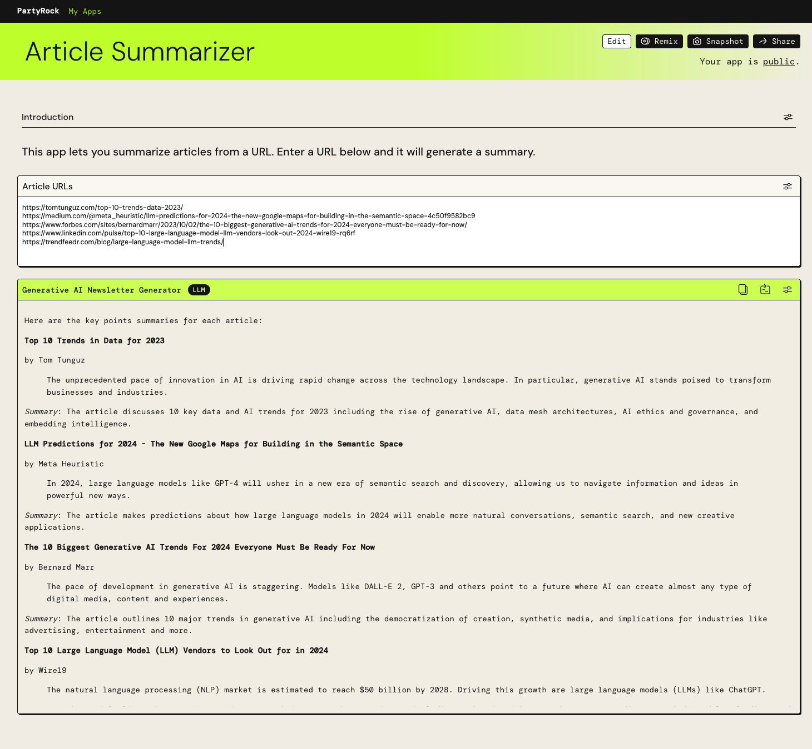
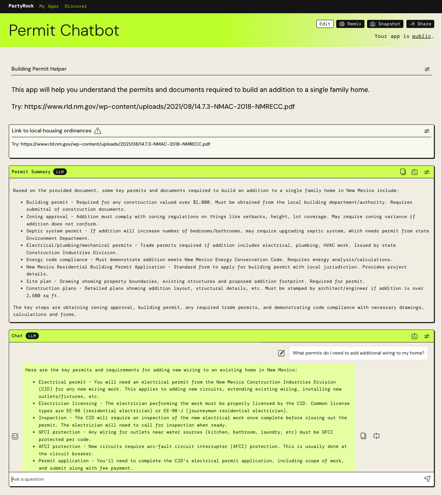
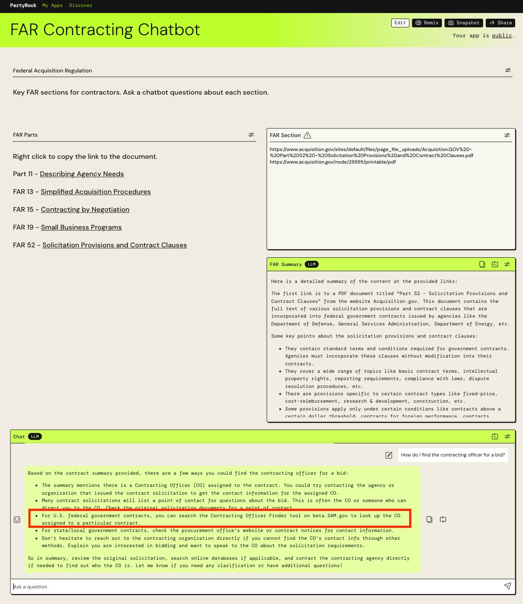
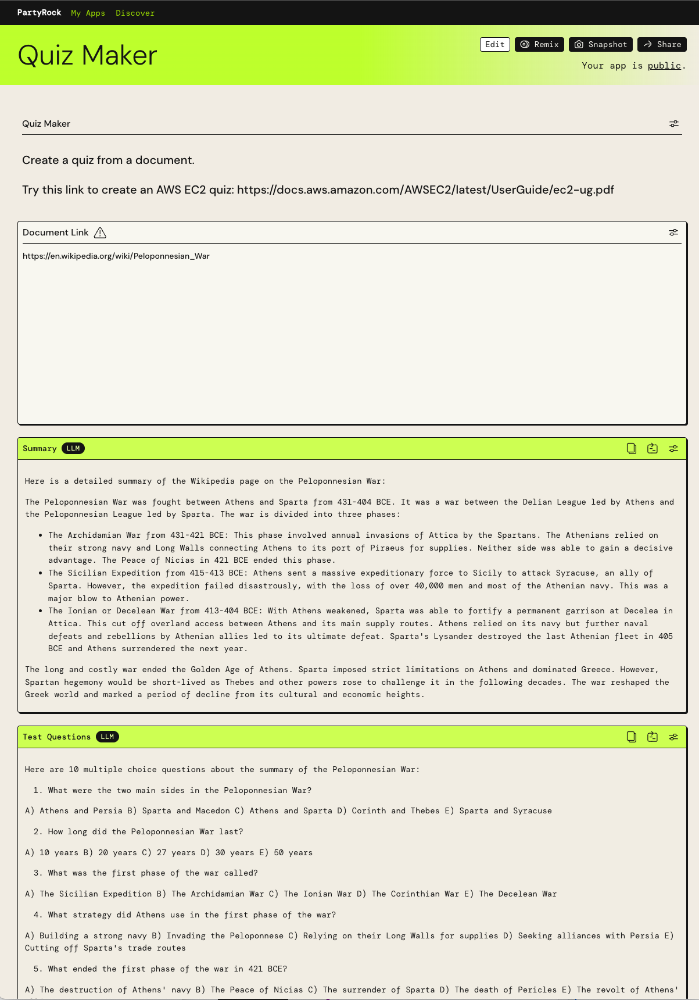
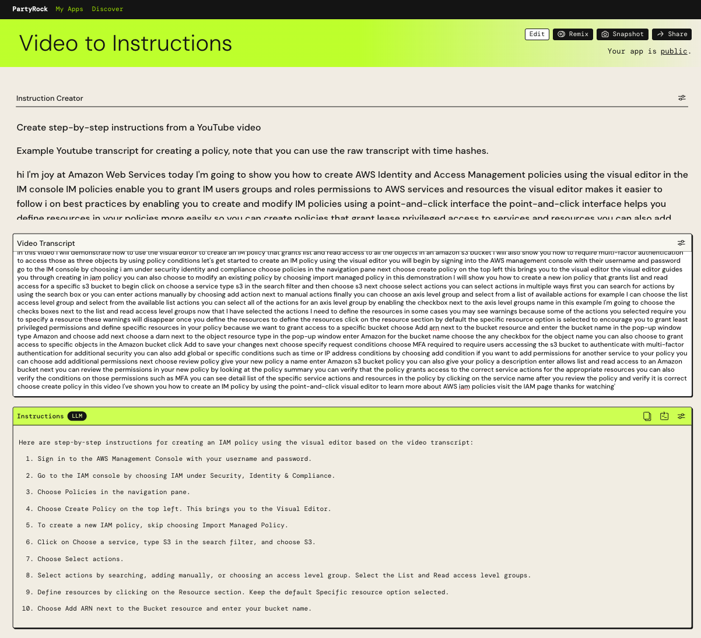

Let’s put [generative AI](https://aws.amazon.com/what-is/generative-ai/?sc_channel=el&sc_campaign=post&sc_content=puttinggenerativeaitoworkwithawspartyrock&sc_geo=mult&sc_country=mult&sc_outcome=acq&sc_publisher=amazon_media&sc_category=other&sc_medium=body) and [Large Language Models (LLMs)](https://aws.amazon.com/what-is/large-language-model/?sc_channel=el&sc_campaign=post&sc_content=puttinggenerativeaitoworkwithawspartyrock&sc_geo=mult&sc_country=mult&sc_outcome=acq&sc_publisher=amazon_media&sc_category=other&sc_medium=body) to work. There is a vast amount of information available on the Internet ranging from blogs to documents to videos. Search engines help us find information but we still have sort and digest search results to find useful and actionable information. This is where LLMs can help because they can sort through text based on a provided context. The ability to understand text extends to an LLMs interface, i.e., you can use native language instructions to tell it what tasks to perform and how to format the results. This article demonstrates how to use AWS PartyRock, a generative AI application playground, to build apps to use internet content more efficiently.

## PartyRock

AWS PartyRock lets you build applications and experiment with a variety of LLMs. You can use PartyRock to generate text with a [prompt](https://aws.amazon.com/what-is/prompt-engineering/#seo-faq-pairs#what-is-a-prompt?sc_channel=el&sc_campaign=post&sc_content=puttinggenerativeaitoworkwithawspartyrock&sc_geo=mult&sc_country=mult&sc_outcome=acq&sc_publisher=amazon_media&sc_category=other&sc_medium=body) or create text summaries. It also lets you generate images using [stable diffusion](https://aws.amazon.com/what-is/stable-diffusion/?sc_channel=el&sc_campaign=post&sc_content=puttinggenerativeaitoworkwithawspartyrock&sc_geo=mult&sc_country=mult&sc_outcome=acq&sc_publisher=amazon_media&sc_category=other&sc_medium=body). And of course, you can build custom chatbots from a body of text. To get started, begin with this intro to PartyRock: [Build AI apps with PartyRock and Amazon Bedrock](https://aws.amazon.com/blogs/aws/build-ai-apps-with-partyrock-and-amazon-bedrock/?sc_channel=el&sc_campaign=post&sc_content=puttinggenerativeaitoworkwithawspartyrock&sc_geo=mult&sc_country=mult&sc_outcome=acq&sc_publisher=amazon_media&sc_category=other&sc_medium=body). When you’re ready, checkout these apps to see how you can build apps with PartyRock.

### Summarize

Keeping up with any topic, whether it’s the latest on Taylor Swift or generative AI, can be a chore. A of strength of LLMs is summarizing articles that let you decide if the article worth reading. You can paste multiple links to articles and get a summary for each one. It lists the authors, the introductory paragraph, and a summary of the article.

### Permit Chatbot

Understanding processes that are embedded in documents, such as local housing ordinances or code can be a confusing task because of the way the information is presented. We can use an LLMs' ability to summarize a document and its ability to organize and respond to question. This application let’s you add a link to a document and ask questions about it.

### FAR Contracting Chatbot

Some processes are very complicated, such as bidding on US government contracts. These are often multi-part documents which cover the rules and regulations for both the organization tendering the bid and contractors responding to the bid. In complex cases, LLMs can help you ask the right question or where to find answers as in the example below.

### Quiz Maker

 If you’re a tech worker, certifications are part of your working life. Certifications demonstrate your knowledge about skills, they keep your skills current, and can be a differentiator during the hiring process. There are many online courses for certifications but before enrolling in a course you can test your current knowledge or review the material with this application. Quiz Maker generates 10 random multiple choice questions from a document, such as a user guide. It also provides the answers below the cut line so you can check your answers. This app works on all sorts of documents and if you have a history of the Peloponnesian War, have at it.

### Video to Instructions

Whether you have a leaking sink or a memory leak in your application, there’s probably a video explaining how to fix the problem. However, you have to watch the video, often pausing and rewinding to capture the steps. LLMs can extract this is information from the video’s transcript. You can manually download the transcript clicking on Show transcript in the video description and copying and pasting it into the app. Alternatively, you can use a tool, like [youtube-transcript-api](https://pypi.org/project/youtube-transcript-api/), to download the transcript. This application converts a video transcript into step-by-step instructions.

Because PartyRock apps can be remixed, you build your own version. For example, if you’ve read [The Checklist Manifesto: How to Get Things Right](https://atulgawande.com/book/the-checklist-manifesto/), you can build an app to create checklists. 

## Do You Want to Know More?

For a limited time, PartyRock is available as a free trial with a set limit of credits.  You do not need an AWS account, leaving you free to experiment and learn. You can track your usage and credit consumption is calculated based on your input tokens, output tokens, and images generated. Check out these learning resources and build!

* [Getting Started](https://partyrock.aws/guide/getStarted?sc_channel=el&sc_campaign=post&sc_content=puttinggenerativeaitoworkwithawspartyrock&sc_geo=mult&sc_country=mult&sc_outcome=acq&sc_publisher=amazon_media&sc_category=other&sc_medium=body)
* [PartyRock FAQ](https://partyrock.aws/guide/faq?sc_channel=el&sc_campaign=post&sc_content=puttinggenerativeaitoworkwithawspartyrock&sc_geo=mult&sc_country=mult&sc_outcome=acq&sc_publisher=amazon_media&sc_category=other&sc_medium=body)
* [Featured Apps](https://partyrock.aws/#featured-apps?sc_channel=el&sc_campaign=post&sc_content=puttinggenerativeaitoworkwithawspartyrock&sc_geo=mult&sc_country=mult&sc_outcome=acq&sc_publisher=amazon_media&sc_category=other&sc_medium=body)